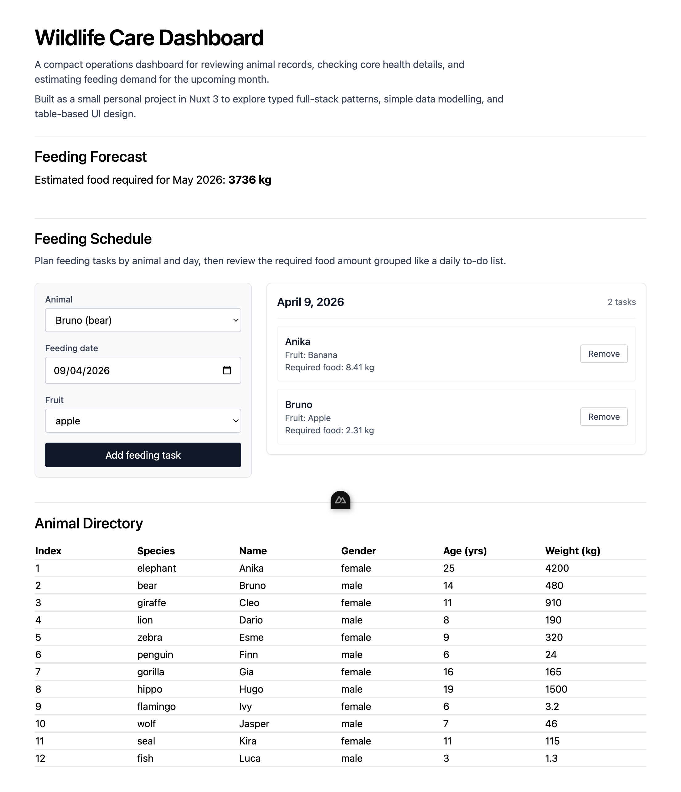

# Wildlife Care Dashboard

A small full-stack Nuxt 3 project for exploring how a zoo or wildlife team might monitor animal records, inspect key metrics, and estimate feeding demand for the upcoming month.

## Summary

This repository is a refactored dashboard project built around a lightweight animal-operations workflow. It started from a constrained dashboard exercise and was reshaped into a cleaner standalone codebase focused on practical Vue/Nuxt patterns, readable utility logic, and a simple full-stack data flow.

The app currently focuses on:

- browsing a curated animal directory,
- opening a detail modal for each animal,
- calculating age from each animal's birthdate,
- estimating the total food required for the next calendar month,
- planning feeding tasks by animal, date, and fruit.

## Highlights

- Built with Nuxt 3, Vue 3, and TypeScript in a single full-stack codebase.
- Uses shared types across UI and server code.
- Includes utility-driven business logic for age and food calculations.
- Includes a lightweight feeding-schedule MVP grouped by day.
- Keeps the UI intentionally small and readable, with room to grow into a richer planning tool.

## Screenshot



## Stack

- Nuxt 3
- Vue 3 Composition API
- TypeScript
- Tailwind CSS
- Vitest
- ESLint

## Running Locally

### Prerequisites

- Node.js LTS
- `pnpm`

### Install

```bash
pnpm install
```

### Start the app

```bash
pnpm run dev
```

The development server runs at `http://localhost:3000`.

### Other scripts

```bash
pnpm run build
pnpm run start
pnpm run test
pnpm run lint
pnpm run typecheck
```

## Refactor Highlights

- Removed challenge-specific story text and assignment artifacts.
- Fixed the monthly food forecast to use the actual number of days in the next calendar month.
- Corrected the food-calculation usage in the dashboard total.
- Cleaned up the README and project notes so the repo reads like a standalone project instead of a take-home submission.
- Repaired the ESLint configuration so targeted linting runs cleanly again.
- Added an in-memory feeding schedule MVP with grouped daily tasks.

## Project Structure

```text
app.vue                          # Main dashboard page
components/
  AnimalDetailModal.vue         # Detail overlay for an animal
  FeedingSchedule.vue           # Feeding planner and grouped task list
  TheAnimalTable.vue            # Sortable animal overview table
composables/
  useAnimals.ts                 # Client-side animal loading
  useCalculateFood.ts           # Feeding requirement calculation
  useFeedingSchedule.ts         # In-memory feeding task state and grouping
docs/
  feeding-schedule-plan.md      # Planning notes and MVP status
server/api/
  animals.get.ts                # Mock animal API endpoint
utils/
  useCalculateAgeInYears.ts     # Age helper
  useCalculateAgeInYears.test.ts
fakeData.ts                     # Curated demo dataset
types.ts                        # Shared application types
```

## Architecture Notes

- `server/api/animals.get.ts` provides a mock API endpoint for animal data.
- `useAnimals.ts` loads animal data on the client and exposes it to the dashboard.
- `useCalculateFood.ts` contains the feeding rules used by the forecast.
- `useFeedingSchedule.ts` stores feeding tasks in memory and groups them by day.
- `useCalculateAgeInYears.ts` keeps age logic isolated and testable.
- The main dashboard composes the forecast, feeding planner, animal table, and detail modal around those shared helpers.

## Feeding Logic

Daily food requirement is calculated from:

1. `(height + weight) / 250`
2. age adjustment
3. favourite fruit adjustment
4. gender adjustment
5. fish override to `0`

The dashboard total multiplies each animal's daily amount by the number of days in the next calendar month.

## Roadmap

- Add table filters for species, age, and feeding needs.
- Persist feeding tasks with local storage or a simple API.
- Add edit support and duplicate-task validation for feeding tasks.
- Add accessibility improvements for keyboard navigation and modal interactions.
- Expand test coverage around the food-calculation rules and forecast totals.

## Notes

- The project currently uses a curated local demo dataset for predictable testing and repeatable screenshots.
- Feeding schedule planning notes and MVP follow-up ideas live in `docs/feeding-schedule-plan.md`.
